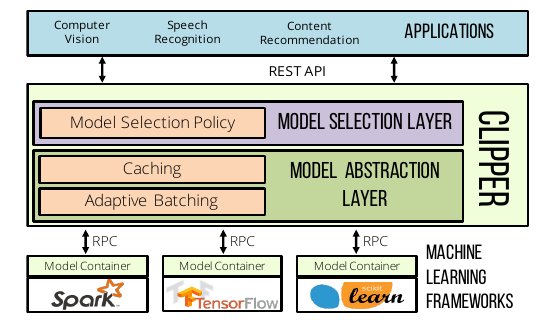

# Clipper: A Low-Latency Online Prediction Serving System (2017)

A **general-purpose** prediction serving system interposing between **end-user applications** and **ML frameworks**

## problem

ML is being used with different ML frameworks and in many applications. But, most ML frameworks and systems only address model **training** and not **deployment**.

ML develoeprs should deal with deploying their models under differnet **frameworks**, **models**, and for different **scalings**.

### targeted applications

- object recongnition
- speech recongnition

### challenges

- Complexity of deployment (model abstraction layer)
- Inference latency and throughput (model abstraction layer)
- Model selection and accuracy (model selection layer)

## solution

- simplify model deployment by **layered modular architecture**
- reduce and bound latency and improve throughput by Model Abstraction Layer (caching,batching)
- improve accuracy, and robustness by Model Selection Layer (adaptive (online) model selection)

### formulation

caching: at model selection layer (LRU)

batch: use SLO to increase latency in exchange for substantially improved throughput

- Dynamic Batch Size: AIMD method
- Delayed Batching: Nagle's algorithm

model container: Prediction Interface

scaling: model container replica scaling

single model selection policy: bandit algorithms (Exp3) => minimal computational overhead in noisy feedback

ensemble model selection policy: linear ensemble method using bandit algorithms (Exp4)

Robust Predictions: confidence score threshold

Straggler Mitigation: simple best-effort strategy (based on late prediction is worse than inaccurate one) using latency deadline (SLO) and invokes subset of ensemble models

Contexualization: model selection layre initiates multiple unique states to keep the users's online feedback

## implementation

- with Rust
- support for frameworks:
  - Apache Spark MLLib
  - Scikit-Learn
  - Caffe
  - TensorFlow
  - HTK

## evaluate

Object Recognition datasets:

- MNIST
  - 70KB
  - 28x28
  - 10 lables
- CIFAR-10
  - 60KB
  - 32x32x3
  - 10 lables
- ImageNet
  - 1.26MB
  - 299x299x3
  - 1000 lables

Speech Recognition datasets:

- TIMIT (with HTK framework)
  - 630 spekers
  - 8 dialects of English
  - 5 sec
  - 30 lables

All experiments were conducted on a single server:

- 2 Intel Haswell-EP CPUs
- 256 GB of RAM
- Ubuntu 14.04 on Linux 4.2.0
- Nvidia Tesla K20c GPUs
  - 5 GB of GPU memory and 2496 cores

Result:

- <20ms latency
- tradeoff accuracy and latency under heavy load
- compared to Google TensorFlow Serving System
- minimal performance cost

## notes

- Interactive Latency = < 100ms
- evaluate Clipper using four **common ML benchmark datasets**
- substantial latencies = 50-100ms
