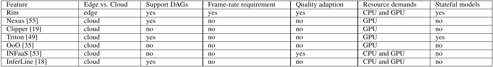

# Rim: Offloading Inference to the Edge

A management system for GPU edge clusters to satisfy throughput and latency while enable high utilization

## Problem

Video-based applications:

- generate significant volumes of traffic
- have multiple ML models (DAGs)

Mobile devices cannot handle newly ML inferences -> we need processing on edge clusters

### Domain & Applications

applications in which video and audio are (a) **generated** by user devices and (b) **processed** in **near real-time**.
We call these **media processing applications**

### Challenges

### Formulation

## Solution

1. Design an abstraction (mDAG)
    - each app session bound to one mDAG
    - Rim allocate resources to mDAG according to requirements

2. Novel techniques for placement management
    - based on mDAG different instances profiles
    - puts mDAG on single (using mDAG profiles) or multiple workers (using module profiles)
    - uses spatial multiplexing: each GPU executes kernels concurrently from multiple DL models

3. Dynamic quality adaption
    - based on mDAG different instances profiles and available resources
    - switch to lighter mDAG implementations -> trade-off between a little accuracy for significant reduce in resource usage

### Components

- master: create sessions and allocate resources to workers to execute mDAGs (**one or more CPU cores** and **exactly one GPU** for each worker)

- worker: executes various mDAG modules according to their data dependency

- client: will call master to initiate a session using pre-defined mDAG unique identifiers. If master admits the session, client will send video frames or audio segments to workers

- session: requests master to allocate resources to execute the mDAG, with specified frame rate and end-to-end latency

- mDAG: application structure abstraction to help keep the GPU utilization high in the cluster. Each module in the mDAG definition can be implemented by one or multiple module instances. During runtime, Rim can dynamically switch between instances

- module: CPU computation or DL model invocation. Each DL invocation (CPU is in future work) have multiple instances

### Architecture

Re-uses two architectural principles in cluster schedulers like **MapReduce** and **The Google FileSystem**

- master-worker design -> master should make placement decisions and workers at each node manage local scheduling objectives
- control-data separation -> workers only call master for control decisions, but data flows to workers without master intervention

### Profiling

- per-mDAG: captures maximum frame rate and each frame delay for single-worker placement
- per-module: each module on each type of worker for cross-worker placement
- considers both CPU and GPU modules profiling, not like Nexus and Clipper which only consider GPU
- NOTE: each mDAG and module will profile on each existing worker

### Placement algorithm

- Frame-rate proportionality -> 1-f/F -> you know the max frame rate of a mDAG instance which worker sustains -> so you know the remained worker capacity when you have only fraction of max for that mDAG
- The peak of GPU usage is for en2ge in our tests is 2.34GB => GPU is not bottleneck in Rim
  - this also has a reason of not using batching, unlike Clipper and Olympian
- Single-worker placement -> best-fit combined with frame-rate proportionality
- Cross-worker placement -> Rim profiles the maximum frame rate of each module to use frame-rate proportionality + considers the serialization overhead  + pins two successive modules together if they have large serialization overhead

### Quality Adaption

when Rim cannot admit new client session, it invokes the quality adaption -> change the mDAG instances:

- will have some mDAG demotions and promotions

### Others

- Generating steering configurations which determines:
  - route to the first module in mDAG
  - the frame rate according to possible parallel mDAGs instances
  - next module route from each module
- Model loading and warm-up
- Handling stateful modules
- High-rate sessions
- Failure and session migration
- Admission control and cloud offload -> try to offload loosest latency target session to the cloud -> if not, evict new session

### Implementation

- Each worker inside a separate container
- Each worker uses TF-Serving to do spatial multiplexing
- includes client library, master, and worker + mDAG library

## Evaluation

### Setup

- Cluster of 8 servers with a total of 14 GPUs
- range of Nvidia GPU models:
  - one Titan
  - one Titan X
  - one Titan Xp
  - two 1080s
  - three 1080 Tis
  - two 2080s
  - four 2080 Tis
- different Intel CPUs: from Xeon E5 to Core i9

### Baselines

- Clipper
- Nexus

### Performance Metric

- average finish rate of each session (output frame rate / input frame rate)
- average SLO-compliance of each session
- average GPU utilization across the cluster -> efficacy of resource management

First two -> guarantees the usability and correctness for media-processing applications

Maintain GPU utilization high enough (52%) -> 2 times of cloud clusters
Handles 100% of its offered load

### comparison

Clipper:

- has no placement algorithm -> GPU-intensive contention (random placement is not resource-aware)
- use independent containers -> can hoard GPU memory resources (it should de-allocate after each use)
- does not profile CPU modules (like face)
- does not support module-level SLO-awareness (only application level; because doesn't support DAG structured apps)

Nexus:

- is significantly impacted by CPU-intensive modules (like face) => because does not profile CPU modules (face)
- should use small size batches in edge clusters which will increase temporal sharing overhead (face)
- homogenous in latency splitting (traffic)

Nexus and Clipper

- lower GPU utilization for two reasons
  - sustain lower frame rate => lower work
  - rely on batching for edge clusters is not efficient => needs spatial multiplexing

### ablation study

- quality adaption
  - finish rate
  - utilization
  - number of sessions
  - SLO compliance

- Placement
  - finish rate

- Cross-worker placement
  - finish rate
  - number of sessions

- Spatial multiplexing
  - finish rate

### justification

- no batching
- admission control
- model loading and warmup
- serialization overhead
- gpu utilization

## Related works

### cluster management for inference

Triton:

- supports spatial multiplex (using CUDA streams), but should manually be configured by system operator

OoO:

- combines temporal and spatial multiplex by merging small kernels to super kernels and reordering them to satisfy latency
- only merge same architecture models

INFaaS:

- abstracts resource management and model selection for image inference
- supports quality adaption and profiles both CPU and GPU components
- not support frame-rate requirements of DAG-structured media-processing apps

InferLine:

- schedules ML pipelines to satisfy end-to-end latency
- selects hardware and batch size for a pipeline according to offline profiling
- does not target frame-rate requirements
- uses temporal multiplexing which is not good in edge settings

TensorFlow-Serving:

- group individual requests into batches
- deploy multiple versions of same model out-of-the-box
- minimize inference overhead
- each Rim worker uses this but added profiling, cross-cluster placement and adaption

GRNN:

- accelerate RNN execution by minimizing overheads and balancing on-chip resource usage

PRETZEL:

- reduce resource usage by operator and parameter sharing in model inference

Focus:

- reduce resource usage by cascade classifier for processing video

### cluster management for training

Gandiva:

- spatial multiplexing for training

Optimus:

- online resource-performance model to estimate training speed per resources and then dynamically allocate resources to each training job minimize overall job completion time

GeePS:

- GPU-specific optimizations, like background GPU/CPU data movement and dat-parallel execution
